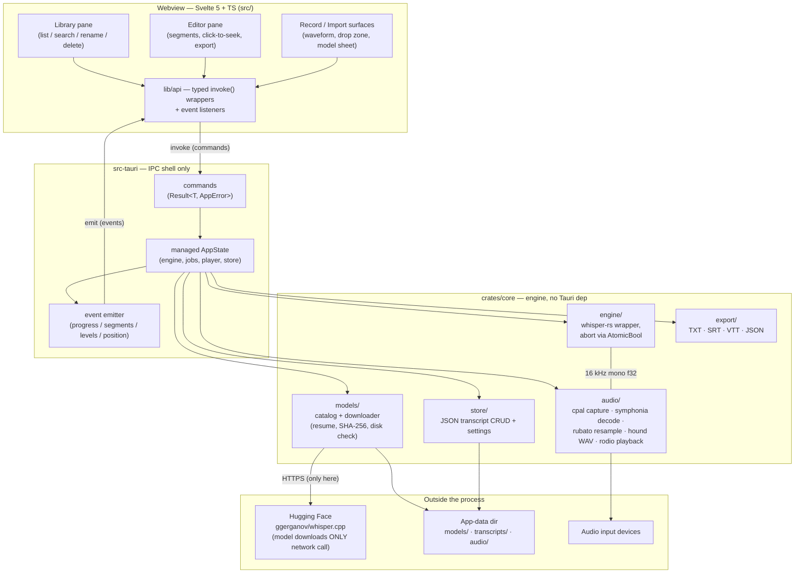

# App overview

One desktop process, two worlds: the **webview frontend** (Svelte 5) and the
**Rust backend**. They talk only through Tauri IPC — typed commands going in,
streamed events coming back. All engine logic lives in `crates/core`, which has
no Tauri dependency and is unit-testable headless; `src-tauri` is a thin shell
that wires core to the IPC surface.

Privacy invariant: the **only** network call in the entire app is the model
download (cyan path above). Audio, transcripts, and metadata never leave the
machine — `SECURITY.md` treats any violation as a security issue, not a bug.

Every module above is implemented; this diagram is now a derived view of
the code. Transcription job queues live in the shell's `AppState` (`jobs`
map + per-job threads), not in core `engine/`. File pickers come from
`tauri-plugin-dialog`; drag-drop uses the webview's built-in events.
