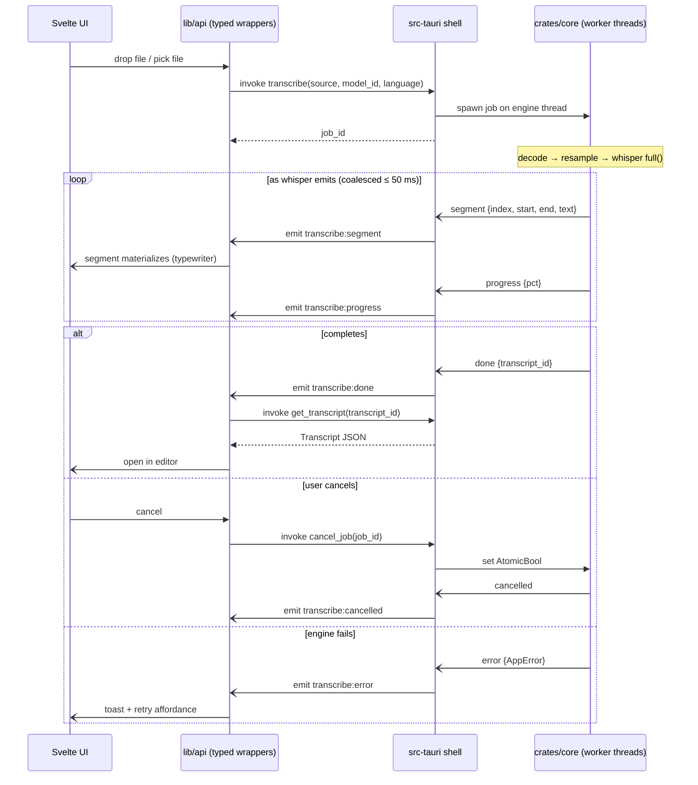

# IPC: import → transcribe → edit round trip

The canonical command/event exchange. Commands are request/response
(`Result<T, AppError>` → typed TS errors); everything long-running streams
back as events. Inference never blocks a command handler — `transcribe`
returns a `job_id` immediately and the work happens on a core-owned thread.

Command surface (full list): `list_models` / `download_model` /
`cancel_download` / `delete_model` · `list_input_devices` / `start_recording`
/ `stop_recording` · `transcribe` / `cancel_job` · `list_transcripts` /
`get_transcript` / `update_transcript` / `rename_transcript` /
`delete_transcript` · `player_load` / `player_play` / `player_pause` /
`player_seek` · `export_transcript` · `get_settings` / `set_settings` ·
`product_info`.

Event surface: `model:download:{progress,done,error}` · `record:level`
(carries `elapsedSecs`) · `transcribe:{segment,progress,done,error,cancelled}`
· `playback:position`.

Implementation status: everything above is implemented in
`src-tauri/src/commands.rs` + `src/lib/api/` EXCEPT the `player_*` commands
and `playback:position`, which land with the rodio playback work (M8). This
file stays `source_of_truth: diagram` until then.
