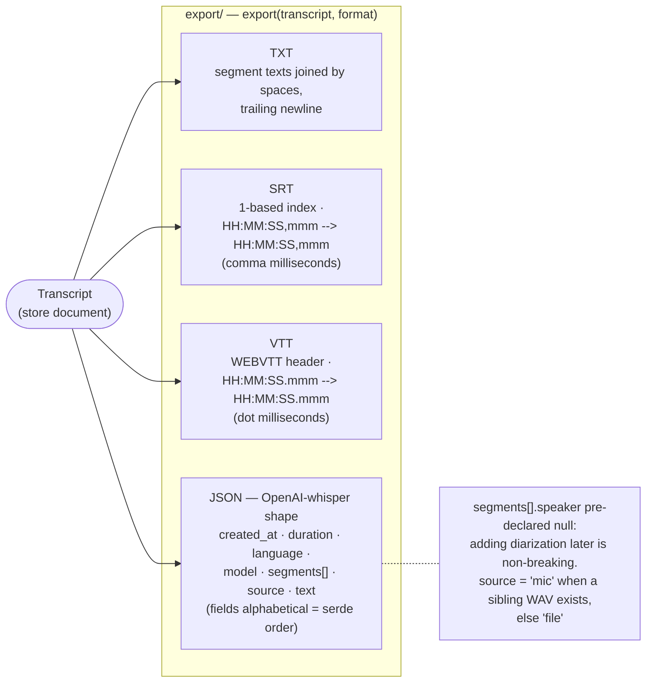

# Export formats

One transcript document, four deterministic renderings — two exports of the
same transcript are byte-identical (golden-file tested under
`crates/core/tests/golden/export/`). Formats mirror the original Swift app's
proven output, minus speaker support (cut from v1).

Rules the goldens pin:

- Timestamps are `round(seconds × 1000)` milliseconds; SRT and VTT differ
  ONLY in the millisecond separator (`,` vs `.`). Hours are always present.
- Segment text is trimmed in every format; empty segments are dropped from
  the joined `text` fields but keep their SRT/VTT cues.
- Intentional format changes regenerate goldens via `UPDATE_GOLDEN=1` — a
  golden diff in review IS the format-change review.
