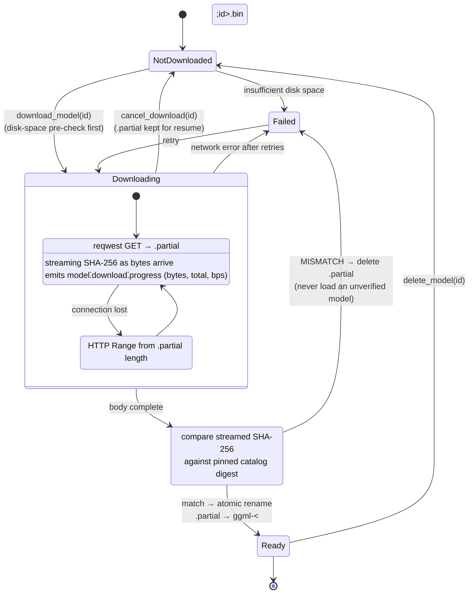

# Model download lifecycle

Models are lazy-downloaded from `huggingface.co/ggerganov/whisper.cpp` with
SHA-256 pinned in the catalog. The catalog (sizes and digests pinned from the
HF LFS metadata, 2026-06-12):

| id | file | size | platform default |
|---|---|---|---|
| `tiny` | ggml-tiny.bin | 74 MB | — (instant preview) |
| `base` | ggml-base.bin | 141 MB | — |
| `small` | ggml-small.bin | 465 MB | Windows |
| `large-v3-turbo` | ggml-large-v3-turbo.bin | 1.55 GB | macOS Apple Silicon |

Two rules the states encode: a model file only ever exists under its final
name **after** digest verification (atomic rename is the commit point), and a
checksum mismatch destroys the partial — there is no "load anyway" path.
