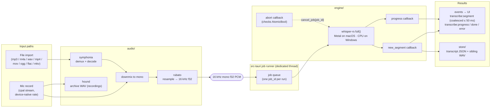

# Transcription pipeline

Both input paths converge on one contract: **16 kHz mono f32 PCM** into the
whisper engine. v1 transcribes after recording stops, but segments stream to
the UI as whisper emits them, so the result *feels* live (true while-recording
transcription is v0.2).

All three subgraphs are implemented and this diagram is now a derived view:
`engine/` (`crates/core/src/engine/whisper.rs` — the job queue lives in the
IPC shell's job runner, not the core engine; the engine is a blocking call
the runner's dedicated thread drives), `audio/`
(`crates/core/src/audio/import.rs` file import,
`crates/core/src/audio/capture.rs` mic capture with archive WAV + ~30 Hz
levels), and `store/` (`crates/core/src/store/`, schema in
`docs/diagrams/store/transcript-schema.md`).

Error paths each surface as a typed `AppError` to the UI and have an
exercising test: unsupported container, decode failure mid-stream, device
disappearing during capture (partial WAV is saved), cancellation (job ends
`cancelled`, partial segments discarded), and model-file-missing (UI routes to
the model sheet).
