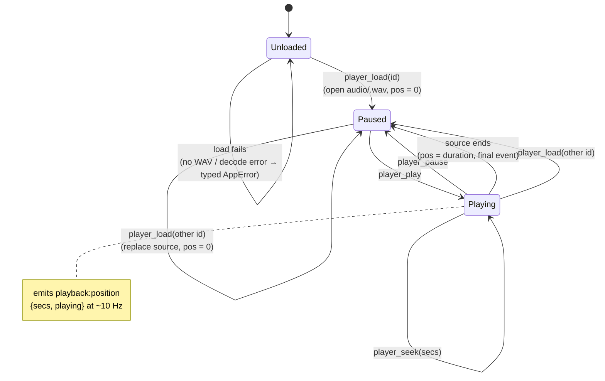

# Player state

Playback is Rust-side (rodio), never HTML5 audio — webview codec support is
inconsistent across WKWebView/WebView2, and rodio plays exactly the archive
WAV we wrote. The rodio output stream is not `Send`, so a dedicated thread
owns it (same pattern as mic capture); commands arrive over a channel, and a
~10 Hz `playback:position` event streams back while playing (plus one event
on every pause / seek / load so the UI never shows a stale position).

Only transcripts with a sibling archive WAV (`audioRelativePath`) are
playable — imports don't store audio in v1. Loading anything else fails
typed; loading while something is already loaded replaces it.

The waveform scrubber uses `player_peaks(id)` — N max-amplitude buckets
precomputed from the archive WAV (pure function, no playback state).
