# Release pipeline

Tag-triggered. Binaries are signed **keylessly in public CI** under this
workflow's GitHub Actions OIDC identity — never a personal identity. The
pipeline re-verifies its own signatures and asserts the certificate SAN
before anything is published, so an artifact signed anywhere else cannot
ship through this path.

```mermaid
flowchart TB
    TAG(["git tag v* pushed"])

    subgraph build["build matrix"]
        MAC["macos-14<br/>tauri build --bundles dmg<br/>→ AttestrumTranscription_&lt;ver&gt;_macos-aarch64.dmg"]
        WIN["windows-latest<br/>tauri build --bundles nsis<br/>→ AttestrumTranscription_&lt;ver&gt;_windows-x64-setup.exe"]
    end

    subgraph sign["sign-and-release (ubuntu, id-token: write)"]
        SUMS["sha256sum * → SHA256SUMS"]
        COSIGN["cosign sign-blob --yes<br/>ambient GHA OIDC → Fulcio cert + Rekor entry<br/>one .sigstore.json bundle per binary"]
        GATE{{"cosign verify-blob<br/>cert SAN matches<br/>release.yml@refs/tags/v* ?"}}
        REL["gh release create<br/>dmg + exe + bundles + SHA256SUMS<br/>(-rc / v0.0.* → prerelease)"]
    end

    USER["Anyone, anywhere:<br/>cosign verify-blob --bundle … --certificate-identity-regexp<br/>'^https://github\\.com/Attestrum/transcription/'<br/>(no Attestrum install needed)"]

    TAG --> MAC --> SUMS
    TAG --> WIN --> SUMS
    SUMS --> COSIGN --> GATE
    GATE -- "Verified OK" --> REL
    GATE -- "mismatch" --> FAIL(["job fails — nothing publishes"])
    REL --> USER
```

The verify command shown to users (README, release notes, attestrum.com) is
byte-identical in all three places — drift between them is a doc bug.
