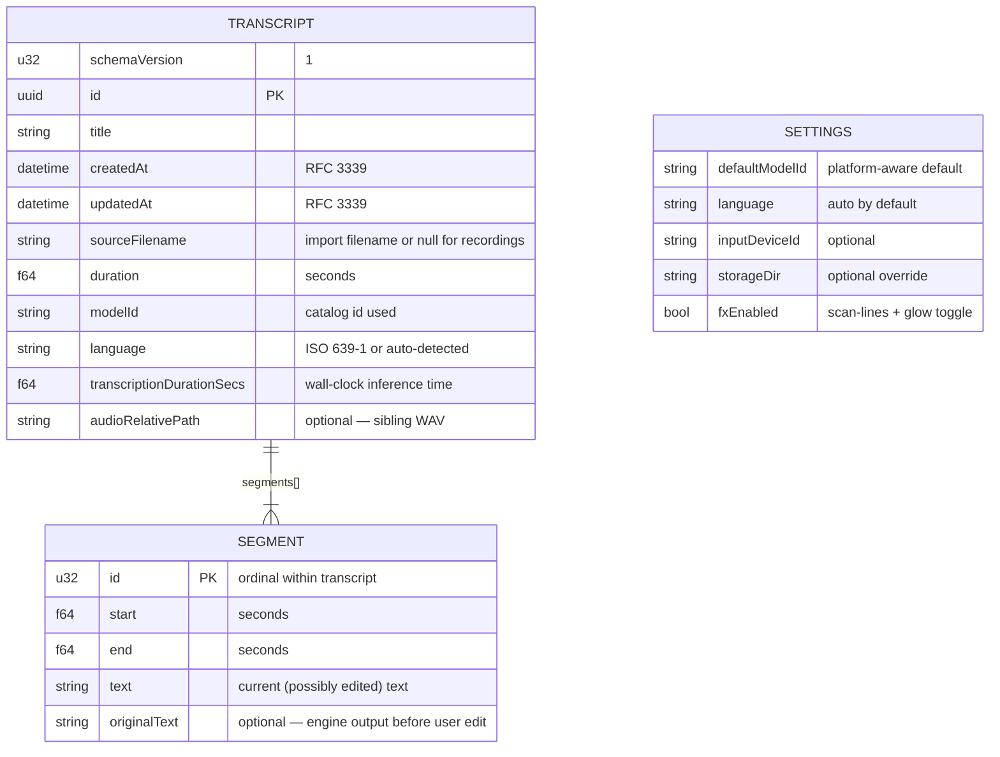

# Transcript store schema

One JSON file per transcript plus, for recordings, a sibling WAV under
`audio/`. The layout mirrors the schema proven in the original Swift app,
including its forward-compat lesson: **unknown/missing optional fields are
tolerated on decode** so older files keep loading as the schema grows.



On-disk layout (inside the app-data dir, or the user's `storageDir` override):

```text
transcripts/<uuid>.json        one TRANSCRIPT document, segments embedded
audio/<uuid>.wav               16-bit PCM archive of recordings only
models/ggml-<id>.bin           verified whisper models
settings.json                  one SETTINGS document
```

Editing rule: the first user edit to a segment copies `text` →
`originalText`, then edits land in `text`. `originalText` is never
overwritten after that — the engine's words stay recoverable.
